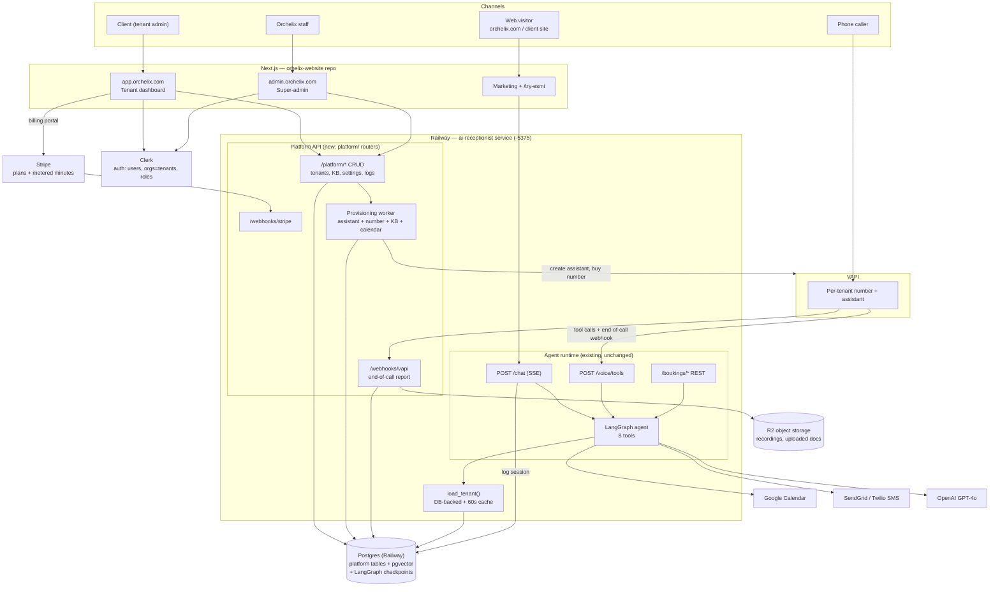
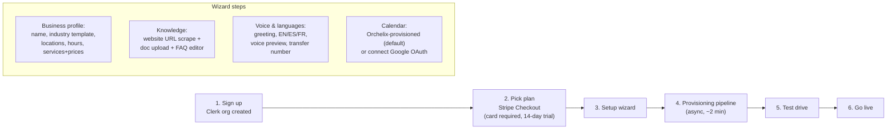

# Esmi Platform Blueprint — from managed service to multi-tenant SaaS

**Status:** proposal (2026-07-28). Companion to `PROJECT_STATUS.md` (current state).
**Goal:** compete with Botphonic, CloudTalk AI, and high-end Retell/Vapi receptionist
products by adding the thing they have and Esmi doesn't: a self-service tenant platform.

The core insight driving every decision below: **the agent runtime is already
multi-tenant and production-hardened.** Ten tenants live in `tenants/`, secrets are
namespaced (`TENANT_<ID>_*`), threads are namespaced, VAPI routes per-tenant. What's
missing is a **control plane** — a database-backed tenant registry, a dashboard, billing,
and automated provisioning. We are not rebuilding Esmi; we are building the cockpit
around her.

---

## 1. Feature set

### 1.1 Super-admin (Orchelix) — `admin.orchelix.com`

**Tenant fleet management**
- Tenant list with health at a glance: plan, status (trial / live / past-due / suspended),
  last call, error rate, minutes used vs plan
- Create / suspend / archive tenants; edit any tenant's config (everything the tenant
  admin can edit, plus the dangerous fields: model choice, temperature, tool enablement,
  prompt overrides)
- **Impersonation** ("view as tenant") with an audit-log entry — the #1 support tool
- Provisioning console: run/retry the onboarding pipeline steps (VAPI assistant create,
  number purchase, calendar setup, KB index build) with per-step status

**Economics & operations**
- Per-tenant unit economics: LLM token cost + VAPI minutes cost + Twilio/SendGrid cost
  vs subscription revenue → margin per tenant (this is what tells you which plan tiers
  are mispriced)
- Fleet dashboard: calls/day, bookings/day, escalations/day across all tenants;
  Railway service health (`/health/deep` for `-5375`), Postgres, VAPI webhook failures
- Incident tools: replay a failed VAPI tool call, view raw webhook payloads,
  re-send a failed confirmation SMS/email

**Product management**
- Prompt template library with **versioning**: base persona templates (barbershop,
  dental, HVAC, law firm, condo — the `demo-*` tenants become real templates),
  per-tenant overrides diffed against the base, one-click rollout / rollback
- Eval harness integration: run the existing behavioral eval suite (`run-evals`)
  against a tenant's prompt before publishing a change
- Feature flags per tenant / per plan (e.g. multi-location, SMS, French, API access)
- Demo tenant management for sales (`demo-dental` etc. reset nightly)

**Billing administration**
- Stripe customer/subscription view per tenant, manual credits, plan overrides,
  dunning status; usage-record audit trail

### 1.2 Tenant admin (the client) — `app.orchelix.com`

**Home / KPIs** (the retention screen — what they show their spouse)
- This week vs last week: calls answered, chats handled, appointments booked,
  leads captured, minutes used, estimated revenue booked (bookings × avg service price)
- "Esmi answered 34 calls after hours this month" — the after-hours counter is the
  single best churn-prevention number; make it prominent

**Activity**
- Call log: timestamp, caller number, duration, outcome badge (booked / info /
  escalated / missed), full transcript, audio recording playback, AI summary
- Chat log: same, for web sessions
- Appointments: upcoming/past list synced from the calendar, with the booking's source
  channel (voice / chat / website widget)
- Leads inbox: name, contact, intent, urgency, transcript link; mark contacted;
  CSV export; (later) push to their CRM via webhook/Zapier

**Agent configuration** (guardrailed — edits validated, versioned, revertible)
- Business profile: name, address(es), hours per location, holiday closures,
  services + durations + prices (writes the same shape `tenants.py` already parses)
- Knowledge base manager: upload PDFs/docs, paste text, "import from my website" URL
  scrape; shows indexed status; test box ("ask Esmi a question") against a sandbox
- Greeting & voice: greeting text per language, language toggles (EN/ES/FR),
  voice selection (curated shortlist, preview audio), transfer/escalation number
- Escalation rules: when to hand off, who gets notified (email/SMS), quiet hours
- Notifications: booking confirmations, daily digest, escalation alerts — per channel

**Test console**
- Embedded web chat against *their* tenant sandbox + "call your Esmi" test number
  button — lets them verify changes before they go live

**Account**
- Team members with roles (Owner / Admin / Viewer), invitations
- Billing: current plan, usage meter (minutes/messages vs plan), invoices,
  Stripe customer portal link, upgrade/downgrade
- Phone numbers: their Esmi number, forwarding instructions, port-in request
- (Higher tiers) White-label: logo + colors on the chat widget and email templates

**Deliberately NOT tenant-editable:** model choice, temperature, tool wiring, raw system
prompt, pricing-tool internals. Prompt-affecting edits go through structured fields that
compile into the prompt template — this is how you scale without every tenant edit
becoming a support incident.

---

## 2. Tech stack recommendation

**Verdict on Streamlit: keep it for internal super-admin during the transition, do not
ship it to tenants.** Streamlit has no real multi-tenant auth story, no white-labeling,
poor mobile UX, and it visually reads as an internal tool — against Botphonic/CloudTalk
polish that costs you deals. You already run Next.js in production (`orhelix-website`),
so the skill and deploy pipeline exist.

| Layer | Choice | Why |
|---|---|---|
| Tenant dashboard | **Next.js 15 (App Router) + Tailwind + shadcn/ui** at `app.orchelix.com` | Production polish, white-label-able, same stack as the marketing site; can live in the `orhelix-website` repo as a second app or route group |
| Super-admin | Same Next.js app behind a role gate (start as Streamlit if speed demands, but plan to fold in) | One codebase, impersonation is trivial when both UIs share components |
| Platform API | **Extend the existing FastAPI app** — new `platform/` router package in this repo | Runtime and control plane share `tenants.py`, tool code, and the DB; split into a second Railway service only when load or deploy-risk demands it |
| Agent runtime | **Unchanged** — LangGraph + `/chat` + `/voice/tools` | It works; the platform reads/writes its config, never its code |
| Database | **Postgres you already have (Railway)** + SQLAlchemy 2 + Alembic migrations | One DB for checkpointer + platform tables; add read replicas later if needed |
| Auth | **Clerk** (Organizations = tenants, invitations, MFA, later SSO) | Fastest credible B2B auth; FastAPI verifies Clerk JWTs; alt: Auth.js + own tables if you want zero vendor spend |
| Billing | **Stripe Billing** — subscriptions + metered usage (`scripts/stripe_setup.py` is the seed) | Metered voice minutes on top of base plans matches every competitor's model |
| Recordings/files | **Cloudflare R2** (S3-compatible) | VAPI recording URLs expire; copy to R2 on end-of-call webhook; zero egress fees |
| KB embeddings | FAISS now → **pgvector** when KB becomes DB-managed | Kills the per-instance `.kb_index/` rebuild and makes KB edits live instantly |
| Background jobs | FastAPI `BackgroundTasks` now → **arq/Redis worker** for provisioning + webhook processing | Provisioning (buy number, create assistant, build index) must survive request timeouts |
| Observability | LangSmith (existing) + Sentry + the `/health/*` endpoints wired to uptime monitor | Already mostly in place per `sales/MONITORING_SETUP.md` |

**Two changes to current conventions this forces:**

1. **Tenant config moves from `tenants/<id>/config.json` to Postgres.** Keep
   `load_tenant()`'s signature; back it with a DB query + 60-second in-process cache +
   file fallback during migration. Config edits in the dashboard become instantly live
   without a redeploy — today every tenant change is a git push that redeploys the
   live service (CLAUDE.md rule #3 pain).
2. **Tenant secrets move from `TENANT_<ID>_*` env vars to encrypted DB columns**
   (Fernet/AES-GCM, master key stays a Railway env var — rule #1 intact). Self-serve
   calendar OAuth *requires* storing refresh tokens at runtime; env vars can't do that
   without a redeploy per signup. Platform-owned keys (OpenAI, VAPI, SendGrid master,
   Stripe) stay env vars.

---

## 3. Architecture



Key property: the **runtime path (caller → agent → tools) has zero new dependencies** —
if the platform API or dashboard is down, calls still get answered. The only coupling is
`load_tenant()` reading Postgres instead of JSON files, and it keeps a cache + fallback.

---

## 4. Data model

New tables (Alembic-managed), alongside the existing LangGraph checkpoint tables.
Every table with tenant data carries `tenant_id` FK + an index on it; every platform API
query is tenant-scoped by middleware, never by handler discipline.

```sql
-- Identity & tenancy ---------------------------------------------------------
tenants (
  id            text PK,          -- slug, same values as today: 'otro-nivel'
  clerk_org_id  text UNIQUE,      -- null for internal/demo tenants
  status        text,             -- trial|live|past_due|suspended|archived
  plan          text,             -- starter|pro|scale|managed
  company_name, business_tz, locale_default,
  created_at, activated_at
)

users            -- mirror of Clerk users we need to reference (id, clerk_user_id, email, name)
memberships      (user_id FK, tenant_id FK, role text)   -- owner|admin|viewer; Clerk is source of truth, this is the query-side mirror

-- Agent configuration (replaces tenants/<id>/config.json) ---------------------
tenant_configs (
  tenant_id FK, version int,      -- append-only; (tenant_id, version) PK
  config jsonb,                   -- exact shape tenants.py parses today: hours, emails,
                                  -- locations, services, sms_templates, transfer_phone...
  published bool, created_by, created_at
)                                 -- load_tenant() reads latest published version

tenant_secrets (
  tenant_id FK, name text,        -- e.g. GOOGLE_OAUTH_REFRESH_TOKEN, TWILIO_AUTH_TOKEN
  ciphertext bytea, key_version int, updated_at,
  PRIMARY KEY (tenant_id, name)
)

prompt_templates (id, vertical text, channel text, body text, version int)  -- barbershop/dental/... × chat/voice
tenant_prompts   (tenant_id FK, channel, template_id FK, overrides jsonb, compiled text, version, published bool)

phone_numbers (
  id PK, tenant_id FK, e164 text, provider text,          -- vapi|twilio
  vapi_phone_number_id, vapi_assistant_id, status, purchased_at
)                                 -- replaces vapi ids living inside config.json

-- Knowledge base --------------------------------------------------------------
kb_documents (id, tenant_id FK, title, source text,       -- upload|url|manual
              storage_key text,   -- R2 key for the original file
              status text,        -- pending|indexed|failed
              created_by, updated_at)
kb_chunks    (id, document_id FK, tenant_id FK, content text,
              embedding vector(1536), token_count)         -- pgvector; replaces FAISS per-tenant

-- Activity (the dashboard's fuel) ---------------------------------------------
calls (
  id PK, tenant_id FK, vapi_call_id UNIQUE, phone_number_id FK,
  caller_e164, started_at, ended_at, duration_sec,
  outcome text,                   -- booked|info|escalated|voicemail|abandoned (derived)
  transcript jsonb, summary text, recording_key text,      -- R2
  cost_vapi numeric, cost_llm numeric
)
chat_sessions (id, tenant_id FK, thread_id, channel text,  -- web|widget|demo
               started_at, last_at, message_count, outcome, summary)
appointments (id, tenant_id FK, location_id, service_id, gcal_event_id,
              customer_name, customer_contact, starts_at, status,   -- booked|rescheduled|cancelled|completed
              source text)        -- voice|chat|website
leads (id, tenant_id FK, name, phone, email, intent, urgency,
       source_call_id FK NULL, source_session_id FK NULL,
       status text,               -- new|contacted|won|lost
       created_at)
escalations (id, tenant_id FK, reason, source_call_id/session_id, notified_via, created_at)

-- Billing & usage --------------------------------------------------------------
usage_records (id, tenant_id FK, metric text,   -- voice_minutes|chat_messages|bookings|sms
               quantity numeric, period_start date, recorded_at,
               stripe_reported bool)
subscriptions (tenant_id FK, stripe_customer_id, stripe_subscription_id,
               plan, status, current_period_end)

-- Platform hygiene --------------------------------------------------------------
audit_log (id, tenant_id FK NULL, actor_user_id, acting_as text NULL,  -- impersonation
           action, target, diff jsonb, at)
api_keys  (id, tenant_id FK, hashed_key, scopes text[], last_used_at)  -- later: public API
webhook_endpoints (id, tenant_id FK, url, secret, events text[])       -- later: CRM push
provisioning_jobs (id, tenant_id FK, step text, status, attempt, error, payload jsonb)
```

**Migration path (zero-downtime):** ship the tables → write a one-shot importer that
loads every `tenants/<id>/config.json` + env-var secrets into the DB → flip
`load_tenant()` to DB-first with file fallback → verify with `deploy-check` +
`verify-pricing` against all live tenants → remove files a release later. Chat/call
logging is additive from day one (no backfill needed; VAPI has historical call export
if you want it).

---

## 5. Onboarding flow: signup → live agent

Two lanes sharing one pipeline. **Self-serve** (Starter/Pro) targets *live in under
15 minutes*; **white-glove** (Managed, today's model) keeps the 14-day process but runs
on the same provisioning machinery — the `new-client` skill's runbook becomes code.



**Step 4 — provisioning pipeline** (each step a `provisioning_jobs` row, retryable,
visible in super-admin):
1. Create `tenants` row + compiled prompt from the industry template (`demo-hvac` etc.
   are the seeds) with the wizard's structured fields injected
2. Create Google Calendar (Orchelix-managed service account — per the standing policy;
   OAuth-connect to the client's own calendar is offered but not default)
3. Ingest KB: scrape URL + uploaded docs → chunk → embed → `kb_chunks`
4. VAPI: create assistant from template (voice, language, tool wiring, webhook secret),
   purchase local number in their area code, attach
5. Register Stripe usage subscription items; send welcome email with test instructions

**Step 5 — test drive:** wizard's final screen shows their number ("call it right now")
+ embedded web chat against their live tenant. First test call detected via the
end-of-call webhook flips a "tested ✓" flag.

**Step 6 — go live:** dashboard shows carrier-specific call-forwarding instructions
(`*72` etc.) for their existing business line; optional port-in request form. Status →
`live` on first real forwarded call.

**Human-in-the-loop guardrail (recommended for the first ~50 self-serve tenants):**
provisioning finishes into a `review` state; you get a Slack/email ping, skim the
generated prompt + KB answers in super-admin, click Approve → number activates. Keeps
quality without blocking the funnel for more than an hour.

---

## 6. Build order

Sequenced so each phase ships alone, funds the next, and never risks the live runtime.
Phase 1 is deliberately *visibility before editability* — a read-only dashboard wows
existing clients and de-risks the DB migration before any write path exists.

| Phase | Weeks | Deliverable | Why first |
|---|---|---|---|
| **0. Foundation** | 1–2 | Alembic + platform tables; config importer; `load_tenant()` DB-backed w/ cache+fallback; VAPI end-of-call webhook → `calls` (+recordings to R2); `/chat` session logging; Clerk wired into a skeleton Next.js `app.orchelix.com` | Everything else stands on this; zero user-visible risk |
| **1. Tenant dashboard v1 (read-only)** | 3–5 | KPIs, call log w/ transcripts+audio, chat log, appointments, leads inbox, CSV export | Immediate retention value for otro-nivel & coastline-condos; your best sales demo; no write-path risk |
| **2. Self-service config** | 6–8 | Hours/services/greeting/notification editing (versioned `tenant_configs`), KB manager w/ pgvector + test box, escalation rules, team members | Kills the "every change is a git push + redeploy" bottleneck — the single biggest ops cost today |
| **3. Billing & metering** | 9–10 | `usage_records` from call/chat events, Stripe subscriptions + metered minutes, plan limits + soft-warning emails, tenant billing page, dunning → `past_due` | Must precede self-serve signup; also lets you convert existing manual invoicing |
| **4. Self-serve onboarding** | 11–14 | Signup wizard + provisioning pipeline (VAPI API, number purchase, KB ingest, calendar), test drive, approve-to-activate queue, super-admin provisioning console | The actual "SaaS moment" — but only viable once 0–3 exist |
| **5. Super-admin v2 & scale** | 15+ | Unit-economics dashboard, impersonation, prompt template library + eval-gated publishing, feature flags, white-label widget, public API + webhooks/Zapier, SSO | Competitive differentiation and enterprise readiness |

**Explicit non-goals for v1:** building your own telephony (stay on VAPI — Botphonic and
half the market are wrappers too; your edge is the agent quality + vertical templates +
white-glove tier), native mobile apps (responsive web), SOC 2 (start the evidence-trail
habits — audit log, access reviews — but don't buy the audit until an enterprise deal
asks).

**First three concrete tickets:**
1. `alembic init` + migration 001 (tenants, tenant_configs, calls, chat_sessions) +
   config.json importer script
2. `POST /webhooks/vapi` end-of-call handler (verify secret, upsert `calls`, copy
   recording to R2, derive outcome from transcript)
3. Next.js `app.orchelix.com` shell: Clerk auth, org switcher, call-log page reading a
   new `GET /platform/calls` endpoint
